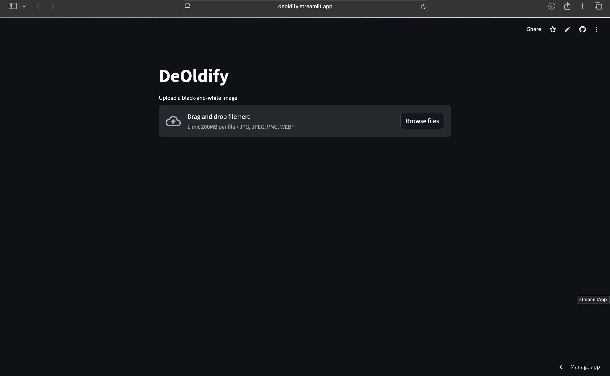

# DeOldify

This project demonstrates how to colorize black-and-white images using a pre-trained deep learning model with OpenCV and Caffe. The model was developed by Richard Zhang et al., and it automatically adds color to grayscale images by predicting the a and b color channels in the LAB color space. This technique is useful for revitalizing old photos or generating color data from grayscale images.

## Overview
This project aims to take black-and-white (grayscale) images and convert them to color using a deep learning model. The Caffe-based model predicts the chrominance values (color) while the lightness channel is preserved from the grayscale image. This technique uses machine learning to infer the most likely colors for various regions of an image.

The process involves:
- Loading a pre-trained model that was trained on thousands of color images.
- Transforming the grayscale image to LAB color space.
- Feeding the lightness channel (*L*) into the model to predict the *a* and *b* channels (chrominance).
- Combining these channels to produce a full-color image.

## Installation

1. Set up a Python virtual environment (recommended):
   ```bash
   python3 -m venv venv
   source venv/bin/activate  # On macOS/Linux
   # or
   venv\Scripts\activate  # On Windows
   ```

2. Install required dependencies:
   ```bash
   pip3 install numpy
   pip3 install opencv-python
   ```

3. Download the necessary model files and save them in the same folder:
   - [colorization_deploy_v2.prototxt](https://github.com/richzhang/colorization/tree/caffe/colorization/models)
   - [pts_in_hull.npy](https://github.com/richzhang/colorization/blob/caffe/colorization/resources/pts_in_hull.npy)
   - [colorization_release_v2.caffemodel](https://www.dropbox.com/s/dx0qvhhp5hbcx7z/colorization_release_v2.caffemodel?dl=1)

4. Giving credits to Richard Zhang for discovering the colorization technique, Check below for more details
   - https://github.com/opencv/opencv/blob/master/samples/dnn/colorization.py
   - http://richzhang.github.io/colorization/
   - https://github.com/richzhang/colorization/

## Usage

1. Update the directories in the code according to your setup.

2. To run the script:
   - Open Command Prompt.
   - Navigate to the folder containing the code and model files using the `cd` command.
     ```bash
     cd /Users/bhaanaveecs/Documents/Colouriser
     ```
   - Run the script and provide the path to the black-and-white image as a parameter:
     ```bash
     python p1.py --image images/eye.jpeg
     ```

## Screenshots




## References
- [Richard Zhang Colorization Project](http://richzhang.github.io/colorization/)
- [OpenCV Colorization Sample](https://github.com/opencv/opencv/blob/master/samples/dnn/colorization.py)
